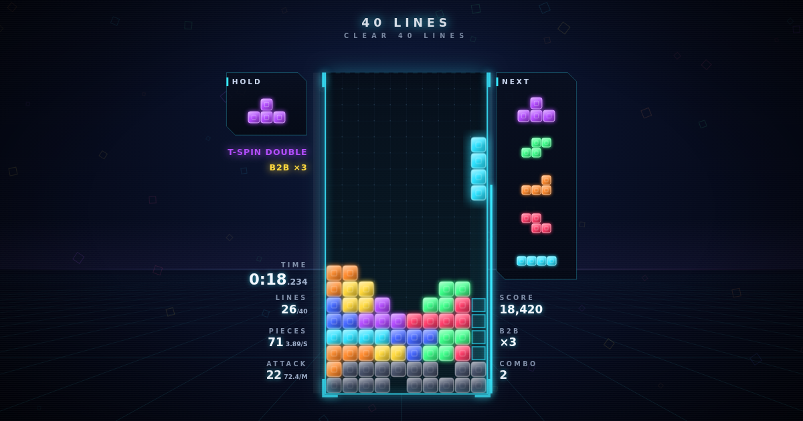

# It's Jedris

**It's Jedris.** Jedris is a fast, modern falling-block game with guideline-accurate mechanics, a neon HUD, local versus, and real-time online versus.

The game itself is plain HTML, CSS and JavaScript with no build step, so it also runs straight from disk. A small Node.js server (Express + WebSockets) hosts it online and runs matchmaking.



## Play

- **Offline:** download or clone the repository and open `index.html` in Chrome, Firefox, Edge or Safari. Every mode except Online Versus works this way.
- **With online play:** run the server (`npm install`, then `npm start`) and open http://localhost:51920.
- **On the web:** see [Deploying to dcism.org](#deploying-to-dcismorg).

## Modes

| Mode | Goal |
| --- | --- |
| **40 Lines** | Clear 40 lines as fast as possible. Personal best is saved. |
| **Blitz** | Score as much as you can in 2 minutes. Gravity rises every 10 lines. |
| **Zen** | Endless, relaxed stacking. No timer and no game over. |
| **Online Versus** | Real-time 1v1 against anyone: quick match, or share a 4-letter room code with a friend. Best of 3, with rematches. |
| **Local Versus** | Two players, one keyboard, split screen. Send garbage to top out your opponent. Best of 3 rounds. |

## Controls

All keys can be rebound in **Config**. Solo modes use the Player 1 keys.

| Action | Player 1 | Player 2 |
| --- | --- | --- |
| Move left / right | `A` / `D` | `←` / `→` |
| Soft drop | `S` | `↓` |
| Hard drop | `W` | `↑` |
| Rotate CCW / CW | `Q` / `E` | `,` / `.` |
| Rotate 180° | `R` | `/` |
| Hold | `Left Shift` | `Right Shift` |
| Quick retry (solo) | `` ` `` | |
| Pause | `Esc` | `Esc` |

Some keyboards can't register many keys at once (ghosting). If inputs drop in versus, try binding keys that are further apart.

### Phones and tablets

On a touch screen an on-screen controller appears while you play. In portrait the board sits on top with the pad underneath; in landscape the pad splits to either side of the board.

- **D-pad:** left / right move and down soft drops. Slide your thumb between them.
- **DROP** (the big button in the middle): hard drop.
- **Buttons:** ↺ rotate CCW, ↻ rotate CW, 180 rotate 180°, HOLD.
- **MENU** pauses (or opens the match menu online) and **RETRY** restarts a solo run.

The pad follows your DAS, ARR and soft drop settings. Local Versus is hidden on touch screens because it needs a shared keyboard. In Online Versus the opponent's board is drawn smaller beside yours.

### Install it as an app

Jedris is an installable web app: it gets its own home-screen icon, opens full screen without the browser bars, and keeps a copy of the game so 40 Lines, Blitz, Zen and Local Versus work offline (Online Versus, accounts and the leaderboard need a connection). It updates itself whenever it's opened online.

- **iPhone / iPad (Safari):** open the site, tap Share, then **Add to Home Screen**.
- **Android (Chrome):** open the site, tap ⋮, then **Install app** (or **Add to Home screen**).

A native App Store or sideloaded iOS build isn't included: installing one outside the App Store needs a Mac with Xcode and an Apple developer account, and free builds expire after 7 days.

## Mechanics

- 10×20 playfield with 2 hidden rows above it
- SRS rotation with full wall-kick tables (separate I-piece table), plus 180° rotation
- 7-bag randomizer (independent per player), hold, 5-piece preview, ghost piece
- 500 ms lock delay that resets on move/rotate, with a maximum of 15 resets per piece
- Configurable DAS, ARR (0 = instant), soft drop factor (including instant) and DAS cut on rotate; the last-pressed direction wins
- Fixed 60 Hz simulation, independent of the display's refresh rate
- T-spin and T-spin Mini detection (3-corner rule), L/J/S/Z/I spins (piece rotated into a spot it can't leave), back-to-back, combos and perfect clears

### Attack table

| Clear | Lines sent |
| --- | --- |
| Single / Double / Triple / Quad | 0 / 1 / 2 / 4 |
| T-Spin Single / Double / Triple | 2 / 4 / 6 |
| T-Spin Mini Single / Double | 0 / 1 |
| Back-to-back bonus | +1 |
| Perfect clear | +10 |
| Combo (2–3 / 4–5 / 6–7 / 8–10 / 11+) | +1 / +2 / +3 / +4 / +5 |

Incoming garbage waits in the meter beside your board for 500 ms. Clearing lines cancels it first. Each attack arrives as rows with one shared hole column.

## Online versus

Each player's browser simulates its own board with the same rules as offline play. Both players get the same piece order each round (one shared seed from the server; garbage holes use a separate random stream so attacks never change it). The server relays each board 30 times a second (so you see your opponent live), forwards attacks as incoming garbage, and decides rounds when someone tops out. The 500 ms garbage delay also absorbs normal network latency.

Protocol (JSON over a WebSocket at `<site>/ws`):

| Client → server | Server → client |
| --- | --- |
| `hello {name, token?}`, `quick`, `create`, `join {code}`, `cancel` | `welcome`, `hello {name, guest}`, `queued`, `room {code}`, `error` |
| `state {s}` (board snapshot), `attack {n}`, `dead {round}` | `match`, `round {seed}`, `opp {s}`, `garbage {n}` |
| `rematch`, `leave`, `ping` | `roundEnd`, `matchEnd`, `rematchAsk`, `opponentLeft`, `pong` |

`GET /api/health` reports the server version and how many players are connected.

## Accounts

Players can create an account with their DCISM ID (for example `s23105047`), a display name and a password of their own, or play as a guest. Signed-in players appear under their display name in online matches (guests can't borrow a registered name), and their 40 Lines and Blitz personal bests are saved to the account. Config (keys, handling, sound) is saved to the account too, so it follows you to any browser, including private tabs.

The **Leaderboard** ranks players by online match wins. A win counts when two different signed-in accounts finish a best-of-3 online match; games against guests and matches someone leaves early don't count.

Accounts live in `data/accounts.json` on the server (set `JEDRIS_DATA` to move it). Passwords are stored as scrypt hashes and sessions as SHA-256 hashes of random tokens. Nothing checks that a DCISM ID belongs to the person typing it, so the first person to register an ID owns it.

Endpoints: `POST /api/auth/signup`, `/api/auth/login`, `/api/auth/password`, `/api/auth/logout`, `GET /api/auth/me`, `POST /api/records`, `PUT /api/settings` and `GET /api/leaderboard`. See `server/auth.js`.

To reset a forgotten password, stop the server first so it doesn't overwrite the change:

```sh
npx pm2 stop jedris
node server/reset-password.js s23105047 newpassword
npx pm2 start jedris
```

## Project layout

```
index.html              Page shell: menus, lobby, settings, help, results
css/style.css           All styling
js/config.js            Constants, default settings, localStorage
js/pieces.js            Piece shapes, SRS kick tables, scoring/attack tables, RNG
js/sound.js             Synthesized sound effects (Web Audio, no audio files)
js/game.js              Game class: board logic, handling, spins, garbage (one per player)
js/input.js             Keyboard → per-player actions
js/touch.js             On-screen controller for phones and tablets
js/render.js            Canvas renderer, HUD and visual effects
js/ui.js                App flow, menus, settings and keybind editor
js/account.js           Sign in, sign up, guest mode and saved personal bests
js/online.js            Online versus client: lobby, networking, opponent board mirror
js/main.js              Fixed-timestep main loop
sw.js                   Service worker: offline copy for the installable app
server/index.js         Node server: static files, /api/health, WebSocket endpoint
server/hub.js           Matchmaking, rooms, rounds and relays
server/auth.js          Accounts: sign-up, login, sessions, records
server/store.js         JSON-file account database (data/accounts.json)
server/reset-password.js  Command-line password reset
deploy/                 pm2 start/stop scripts for dcism.org
ecosystem.config.cjs    pm2 process file
assets/                 Favicon, app icons and share image
tests/                  Logic suite (open tests/index.html), UI and online end-to-end tests
```

The client uses plain `<script>` tags rather than ES modules, so it still runs when `index.html` is opened directly from disk.

## Development

Requires Node.js 18 or newer.

```sh
npm install
npm start                 # http://localhost:51920 (PORT and HOST env vars override)
```

Tests:

```sh
npx playwright install chromium   # once
npm test                          # server unit tests, game logic + UI, two-browser online match
```

You can also open `tests/index.html` in a browser to run the game-logic suite by hand. GitHub Actions runs `npm test` on every push and pull request.

## Deploying to dcism.org

Jedris runs as a Node.js app under dcism.org's **Custom Application Hosting**.

1. **Pick the hosting type:** in admin.dcism.org → Subdomains → your subdomain's settings, set **Hosting Environment** to *Custom Application Hosting*. Note the port it shows (for example `20279`). You can also turn on **Force SSL** there.
2. **Upload** the project into the subdomain folder (for example `~/jedris.dcism.org`). You can use SFTP, skipping `node_modules/`, `tests/` and `.github/`, or run `git clone https://github.com/jedidiah5K/Jedris.git .` in the empty folder.
3. **Install and start it** in the dcism terminal, using your port:
   ```sh
   cd ~/jedris.dcism.org
   npm ci --omit=dev
   PORT=20279 sh deploy/start.sh
   ```
   This runs the server under pm2 (bound to `0.0.0.0` on your port), saves the pm2 process list, and checks `/api/health`.
4. **Open** `https://<your-subdomain>.dcism.org`.

Useful commands:

```sh
npx pm2 status                   # is it running?
npx pm2 logs jedris --lines 30   # recent logs
sh deploy/stop.sh                # stop it
```

To update: pull or upload the new files, run `npm ci --omit=dev`, then run `PORT=<port> sh deploy/start.sh` again. Updating never touches `data/`, so accounts are kept. Back up `data/accounts.json` now and then.

pm2 restarts Jedris if it crashes. dcism accounts can't make pm2 start automatically when the machine reboots, so after a server reboot run `deploy/start.sh` again.

No `.htaccess` is needed: Custom Application Hosting forwards the subdomain to your port by itself. Delete any `.htaccess` left over from an older setup.

The display fonts load from Google Fonts. If they're unavailable, the game falls back to system fonts.

## Credits

Built by [@jedidiah5K](https://github.com/jedidiah5K). Jedris is an independent project. It isn't affiliated with or endorsed by any other block-stacking game or its owners.
